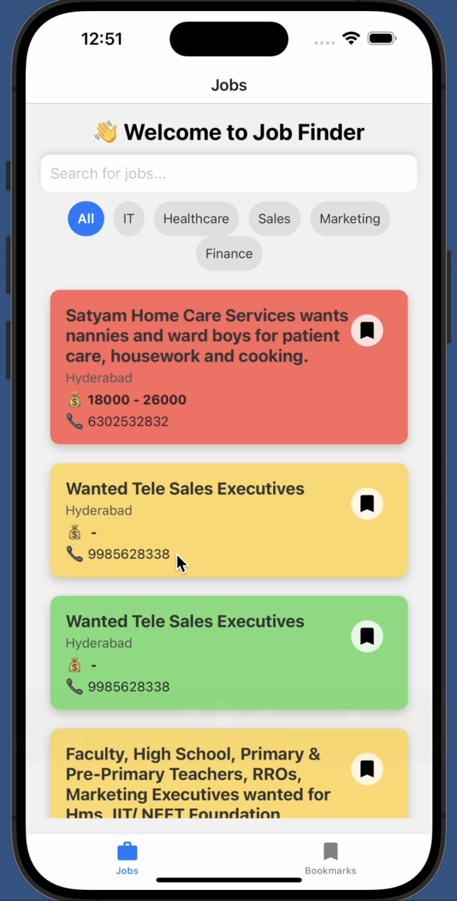
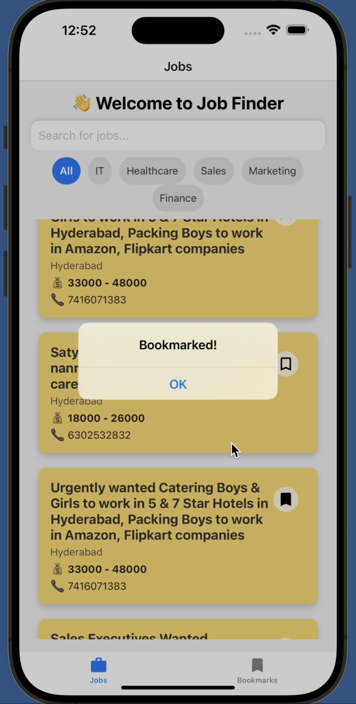
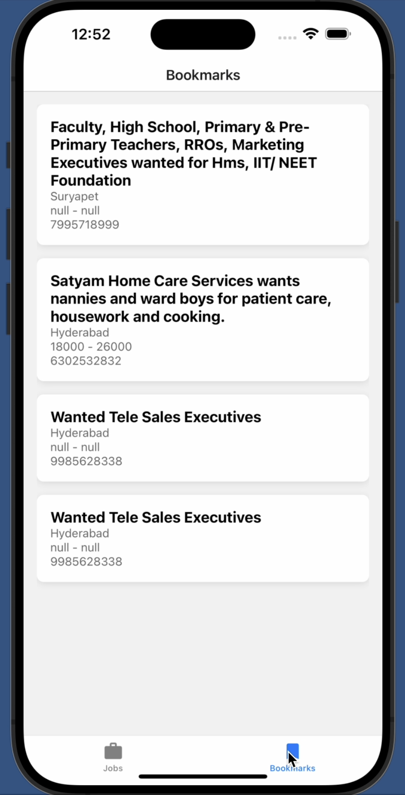

# **Keep jobs**

## 📌 ***Overview***

Job Finder is a React Native application that helps users find jobs using sleek UI. It allows users to:

Browse job listings fetched via an API with infinite pagination

Bookmark jobs for later access using SQLite

View job details on a separate screen

Two-tab navigation: "Jobs" and "Bookmarks"

### 🎨 Features

- ✅ Bookmark Jobs – save jobs using SQLite and view them in the "Bookmarks" tab
- ✅ Smooth Navigation – Jobs & Bookmarks tabs use Stack Navigation for job details
- ✅ Persistent Data – Bookmarked jobs remain saved after app restarts
- ✅ Optimized API Calls – Uses pagination to fetch jobs efficiently

### 🏗 Tech Stack

- React Native (Expo)
- React Navigation (Bottom Tabs & Stack Navigation)
- Axios (Fetching jobs from API)
- Expo SQLite (Saving bookmarked jobs locally)
- Vector Icons (Material Icons for better UI)

### 🚀 Installation & Setup

1️⃣ Clone the Repository
```
git clone https://github.com/ak74aytg/keep_jobs.git
cd keep_jobs
```
2️⃣ Install Dependencies
```
npm install
```
 OR if using Expo
```
expo install
```
3️⃣ Run the App
```
npm start
```
 OR
```
expo start
```
📂 Project Structure
```bash
keep_jobs/
│── components/
│   ├── JobCard.js  
│── screens/
│   ├── JobsScreen.js   
│   ├── BookmarksScreen.js   
│   ├── JobDetailsScreen.js  
│── AppNavigator.js  
│── App.js   
│── README.md   
```
🔄 API Integration

Endpoint: https://testapi.getlokalapp.com/common/jobs?page={page}

Uses pagination to fetch data efficiently

Handles missing properties in job objects gracefully

## 📌 ***Navigation Structure***

The app uses Bottom Tabs Navigation and Stack Navigation:

Bottom Tab Navigation:

"Jobs" → JobsScreen (Stack: Job List → Job Details)

"Bookmarks" → BookmarksScreen (Stack: Bookmarked Jobs → Job Details)

Stack Navigation:

JobsScreen → JobDetailsScreen

BookmarksScreen → JobDetailsScreen

🛠 Future Enhancements

🚀 Dark Mode Support🚀 Advanced Filters (Job Type, Salary, Location)🚀 Push Notifications for New Jobs


## 📸 Screenshots

<p align="center">
  
 
  
  
</p>


## 🎥 Demo Video

[Click here to watch](https://drive.google.com/file/d/1NySUE53CloKdmaFFxFS-WWglQCV6qC-1/view?usp=share_link)

🤝 Contributor

Akshay– https://github.com/ak74aytg
